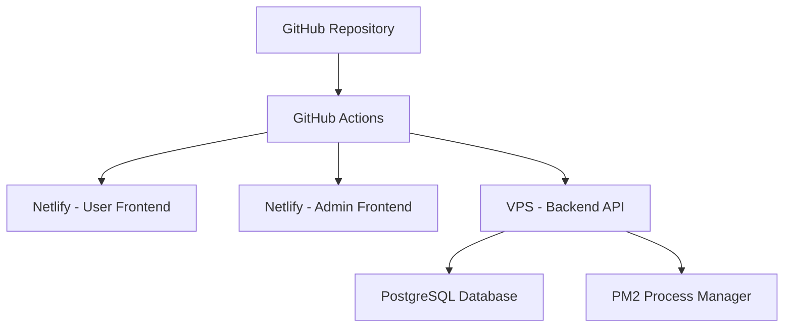

# 🚀 DEPLOYMENT GUIDE: GitHub + Netlify + VPS

Hướng dẫn chi tiết triển khai **votingonline2025.site** với GitHub + Netlify + VPS

## 📋 **THÔNG TIN HỆ THỐNG**

- **Domain chính**: `votingonline2025.site`
- **Admin Panel**: `admin.votingonline2025.site` 
- **Backend API**: `api.votingonline2025.site`
- **VPS**: `85.31.224.8` (CyberPanel)
- **Database**: PostgreSQL

## 🎯 **KIẾN TRÚC TRIỂN KHAI**



## 🔧 **CHUẨN BỊ TRƯỚC KHI DEPLOY**

### 1. **GitHub Repository Setup**
```bash
# Clone repository
git clone https://github.com/your-username/voting-system.git
cd voting-system

# Đảm bảo branch main sạch sẽ
git status
git push origin main
```

### 2. **Netlify Account Setup**
1. Tạo account tại [netlify.com](https://netlify.com)
2. Tạo 2 sites:
   - Site 1: User Frontend → `votingonline2025.site`
   - Site 2: Admin Frontend → `admin.votingonline2025.site`
3. Lưu Site IDs từ Site Settings

### 3. **VPS Access Setup**
```bash
# Test SSH connection
ssh root@85.31.224.8

# Verify CyberPanel access
https://85.31.224.8:8090
# Username: admin
# Password: 123123zz#Bong
```

## 🚀 **HƯỚNG DẪN DEPLOY BƯỚC THEO BƯỚC**

### **BƯỚC 1: Setup VPS Environment**

```bash
# Chạy script setup VPS
scp deployment/vps-setup-votingonline2025.sh root@85.31.224.8:/tmp/
ssh root@85.31.224.8 "bash /tmp/vps-setup-votingonline2025.sh"
```

Script này sẽ:
- ✅ Cài đặt Node.js 18, PostgreSQL, PM2
- ✅ Tạo database `voting_production_2025`
- ✅ Cấu hình Nginx cho 3 domains
- ✅ Setup firewall và monitoring

### **BƯỚC 2: Cấu hình GitHub Secrets**

Vào GitHub Repository → Settings → Secrets and variables → Actions, thêm:

```
# Netlify
NETLIFY_AUTH_TOKEN=your_netlify_auth_token
NETLIFY_USER_SITE_ID=your_user_site_id
NETLIFY_ADMIN_SITE_ID=your_admin_site_id

# VPS
VPS_SSH_PRIVATE_KEY=your_ssh_private_key
```

### **BƯỚC 3: Setup Database**

```bash
# Chạy script setup database
scp deployment/database-production-setup.sql root@85.31.224.8:/tmp/
ssh root@85.31.224.8 "su - postgres -c 'psql -f /tmp/database-production-setup.sql'"
```

### **BƯỚC 4: Cấu hình DNS**

Trong DNS provider của bạn, thêm A records:

```
A    votingonline2025.site           → 85.31.224.8
A    admin.votingonline2025.site     → 85.31.224.8  
A    api.votingonline2025.site       → 85.31.224.8
```

### **BƯỚC 5: Setup SSL Certificates**

Trong CyberPanel:
1. Vào SSL → Issue SSL
2. Chọn domain: `votingonline2025.site`
3. Add domains:
   - `votingonline2025.site`
   - `www.votingonline2025.site`
   - `admin.votingonline2025.site`
   - `api.votingonline2025.site`
4. Issue Let's Encrypt certificate

### **BƯỚC 6: Deploy Tự Động**

```bash
# Chạy script deploy
bash scripts/deploy-production.sh
```

Hoặc push code để GitHub Actions tự động deploy:

```bash
git add .
git commit -m "🚀 Deploy to production"
git push origin main
```

## 🔍 **KIỂM TRA SAU DEPLOY**

### **Health Checks**
```bash
# User Frontend
curl -f https://votingonline2025.site

# Admin Frontend  
curl -f https://admin.votingonline2025.site

# Backend API
curl -f https://api.votingonline2025.site/api/health
```

### **Database Connection**
```bash
ssh root@85.31.224.8
su - postgres -c "psql voting_production_2025 -c 'SELECT COUNT(*) FROM users;'"
```

### **PM2 Status**
```bash
ssh root@85.31.224.8
pm2 status
pm2 logs voting-api
```

## 📊 **MONITORING & MAINTENANCE**

### **Log Files**
```bash
# Application logs
tail -f /home/votingonline2025.site/logs/pm2-combined.log

# Nginx logs
tail -f /var/log/nginx/access.log
tail -f /var/log/nginx/error.log

# Database logs
tail -f /var/log/postgresql/postgresql-14-main.log
```

### **PM2 Commands**
```bash
# Restart application
pm2 restart voting-api

# View logs
pm2 logs voting-api --lines 100

# Monitor performance
pm2 monit
```

### **Database Maintenance**
```bash
# Backup database
pg_dump -U voting_user -h localhost voting_production_2025 > backup.sql

# Restore database
psql -U voting_user -h localhost voting_production_2025 < backup.sql
```

## 🔧 **TROUBLESHOOTING**

### **Frontend không load**
1. Kiểm tra DNS đã propagate chưa
2. Kiểm tra SSL certificate
3. Check Netlify build logs

### **Backend API lỗi**
```bash
# Check PM2 status
pm2 status

# Check logs
pm2 logs voting-api

# Restart service
pm2 restart voting-api
```

### **Database connection issues**
```bash
# Check PostgreSQL status
systemctl status postgresql

# Test connection
psql -U voting_user -h localhost voting_production_2025
```

## 📞 **SUPPORT**

- **GitHub Issues**: Tạo issue trong repository
- **Documentation**: Xem file README.md
- **Logs**: Check PM2 và Nginx logs trên VPS

## 🎉 **HOÀN TẤT DEPLOYMENT**

Sau khi deploy thành công:

✅ **User Site**: https://votingonline2025.site  
✅ **Admin Panel**: https://admin.votingonline2025.site  
✅ **Backend API**: https://api.votingonline2025.site  

**Default Admin Login:**
- Email: `admin@votingonline2025.site`
- Password: `admin123`

> **⚠️ LƯU Ý**: Nhớ đổi password admin sau lần đăng nhập đầu tiên!

